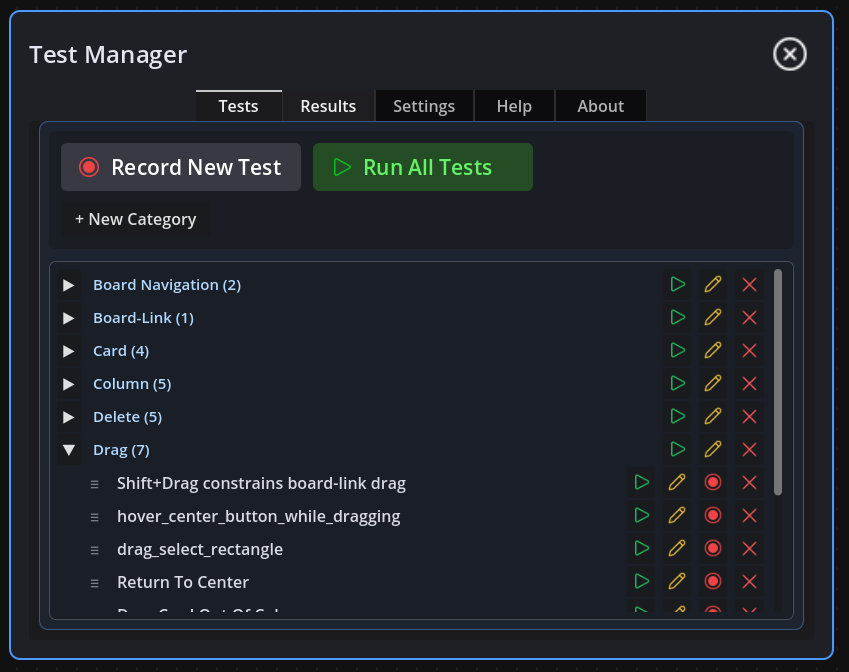
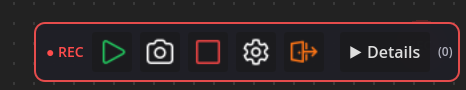
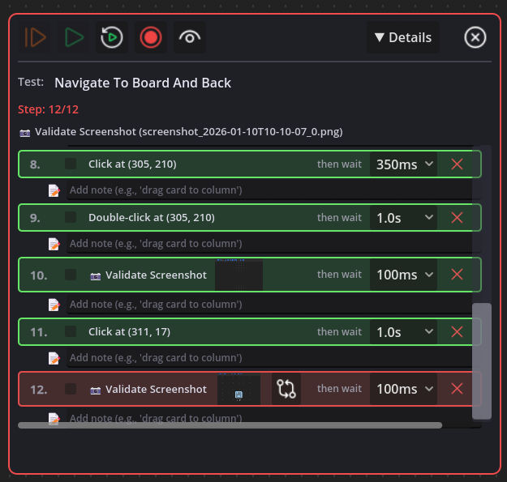
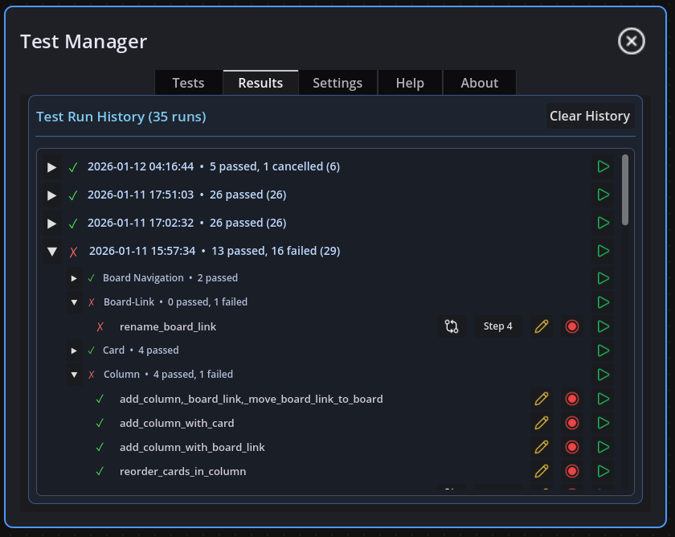
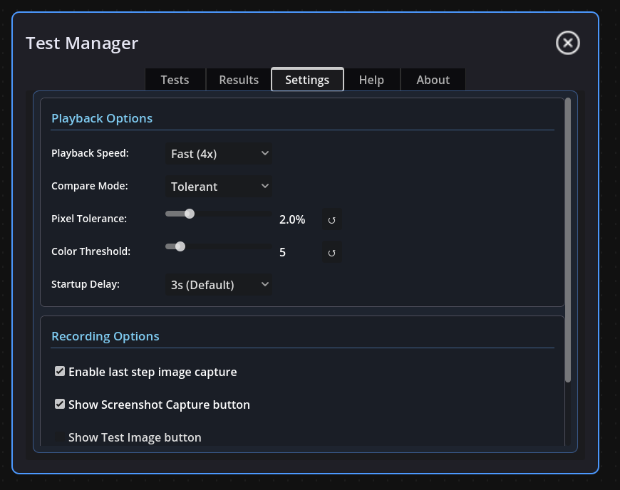
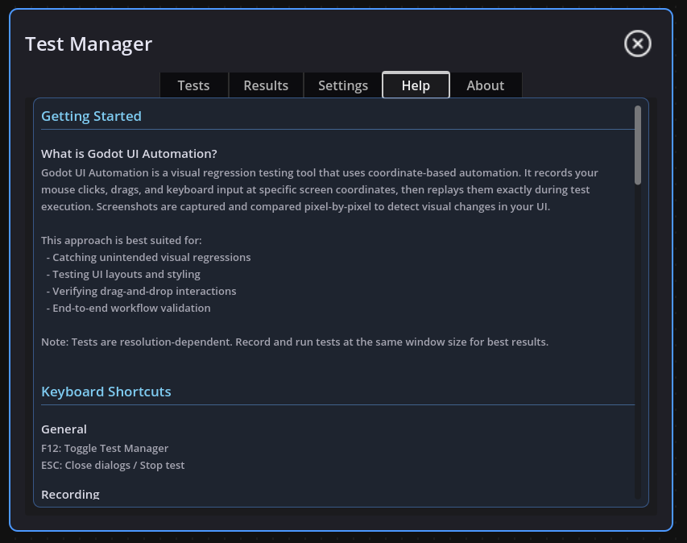

# Godot UI Automation

A visual UI automation testing framework for Godot 4.x that enables recording, playback, and validation of user interface interactions.

## Features

- **Record & Replay**: Record mouse clicks, drags, double-clicks, and keyboard input with visual cursor feedback
- **Screenshot Validation**: Capture baseline screenshots and validate against them with configurable tolerance
- **Multiple Screenshots**: Capture multiple checkpoints during a single test for comprehensive validation
- **Test Manager**: Built-in UI for organizing, running, and managing tests with categories
- **Inline Thumbnails**: Preview screenshots directly in the test editor
- **Tolerant Comparison**: Configure pixel tolerance and color threshold for flexible matching
- **Pause/Resume Recording**: Pause recording to interact with your app without capturing events

## Installation

1. Copy the `addons/godot-ui-automation` folder to your project's `addons` directory
2. Enable the plugin in Project Settings > Plugins
3. The plugin auto-registers as an autoload singleton

## Usage

### Keyboard Shortcuts

| Key | Action |
|-----|--------|
| **F12** | Toggle Test Manager |
| **F11** | Start/Stop Recording |
| **F10** | Capture screenshot (during recording) |
| **T** | Terminate drag segment (during recording) |
| **P** | Pause/Resume test playback |
| **Space** | Step forward (when paused) |
| **R** | Restart current test |
| **ESC** | Cancel recording / Close dialogs / Stop test |

### Recording a Test

1. Press **F11** to start recording
2. Interact with your UI - clicks, drags, and keyboard input are captured
3. Press **F10** to capture screenshot checkpoints at important moments
4. Press **T** to terminate a drag segment (useful for complex drag operations)
5. Press **F11** to stop recording
6. Edit test name and step delays in the Step Editor
7. Click **Save Test**

#### Step Editor

After recording, use the Step Editor to fine-tune your test:

### Adding Delays

During recording, you can add wait periods between actions:
- Use the **wait dropdown** in the Event Editor to adjust delays for each step
- Click **Insert Wait** to add a dedicated wait step at any point

### Terminate Drag

Press **T** during recording to terminate a drag segment. This is useful when:
- Recording complex drag operations that should be split into multiple segments
- You need precise control over where drag operations end
- The automatic drag detection isn't capturing your intended behavior

### Running Tests

1. Press **F12** to open the Test Manager
2. Click the play button (▶) next to a test to run it
3. Use "Run All Tests" to execute all tests in sequence
4. View results in the Results tab
5. Click the rerun button (↻) to rerun individual tests from results

### Test Organization

- Create categories to group related tests
- Drag tests between categories
- Run all tests in a category with the category play button

## Configuration

In the Test Manager's Settings tab:

- **Playback Speed**: Instant, Fast, Normal, Slow, or Step (manual)
- **Comparison Mode**: Pixel Perfect or Tolerant
- **Pixel Tolerance**: Percentage of pixels allowed to differ (0-10%)
- **Color Threshold**: Maximum RGB difference per pixel (0-50)

Settings are saved to: `user://godot-ui-automation-config.cfg`

## File Structure

Tests are stored in `res://tests/ui-tests/`:
- Test definitions: `test_name.json`
- Baseline screenshots: `res://tests/baselines/baseline_test_name.png`

## Requirements

- Godot 4.5+
- Windows (currently tested on Windows only)

## Help

The Test Manager includes a built-in Help tab with detailed documentation:

## Support & Community

- **Discord**: https://discord.gg/9GnrTKXGfq
- **GitHub**: https://github.com/graydwarf/godot-ui-automation
- **More Tools**: https://poplava.itch.io

## License

MIT License - Copyright (c) 2025 Poplava

See LICENSE file for details.
